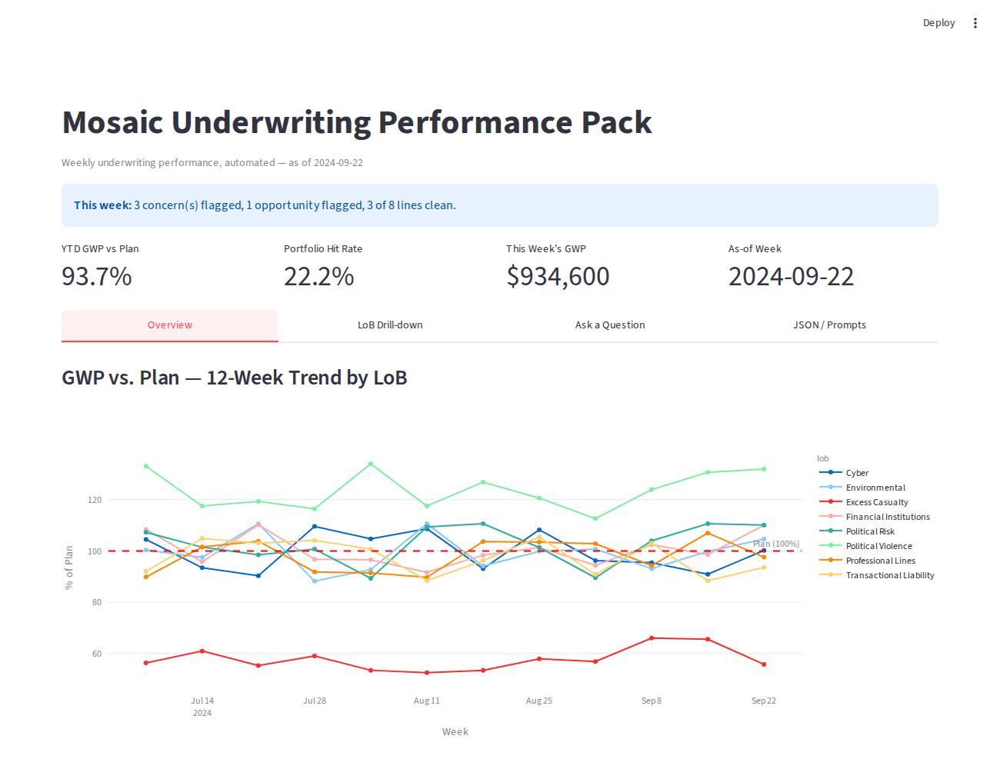
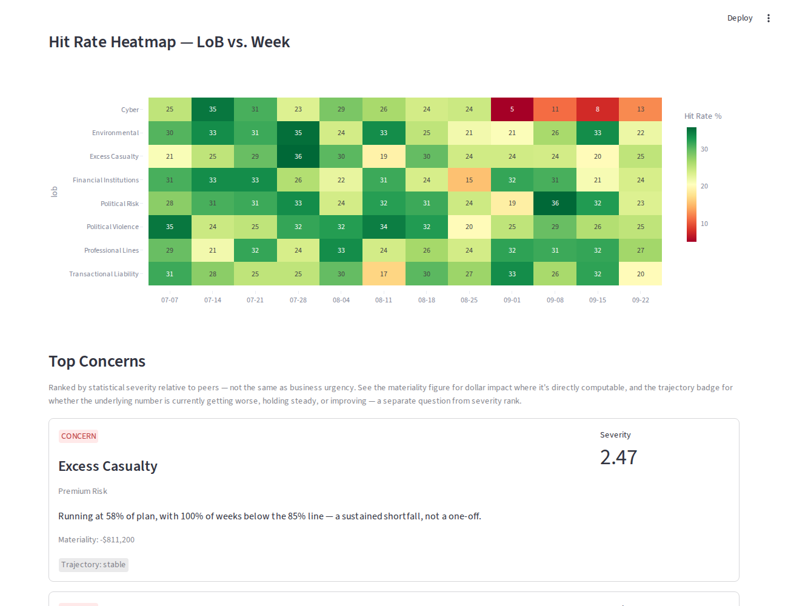
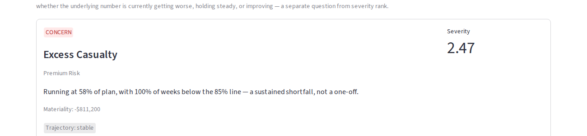
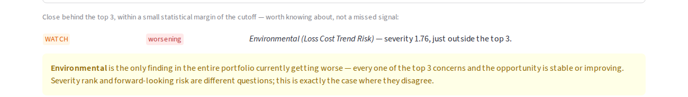
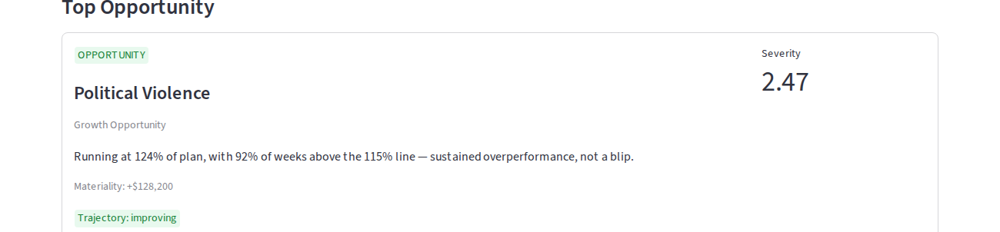
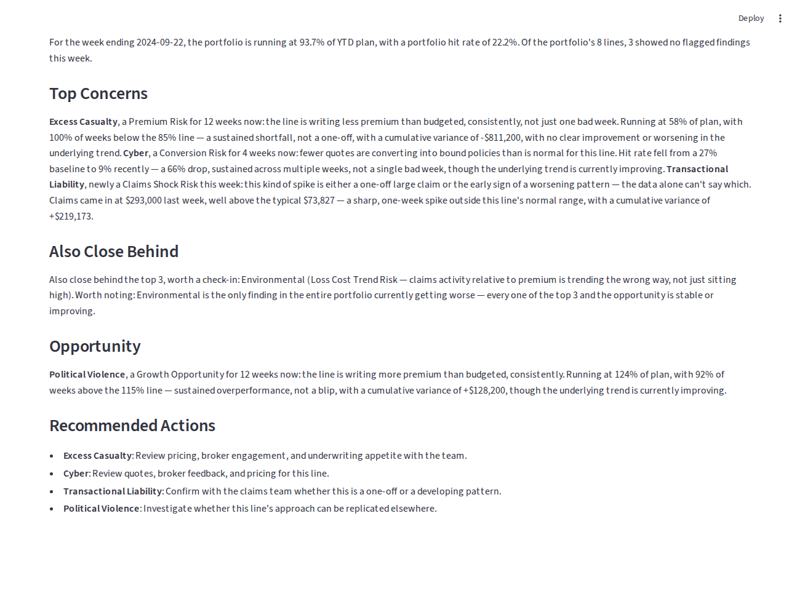
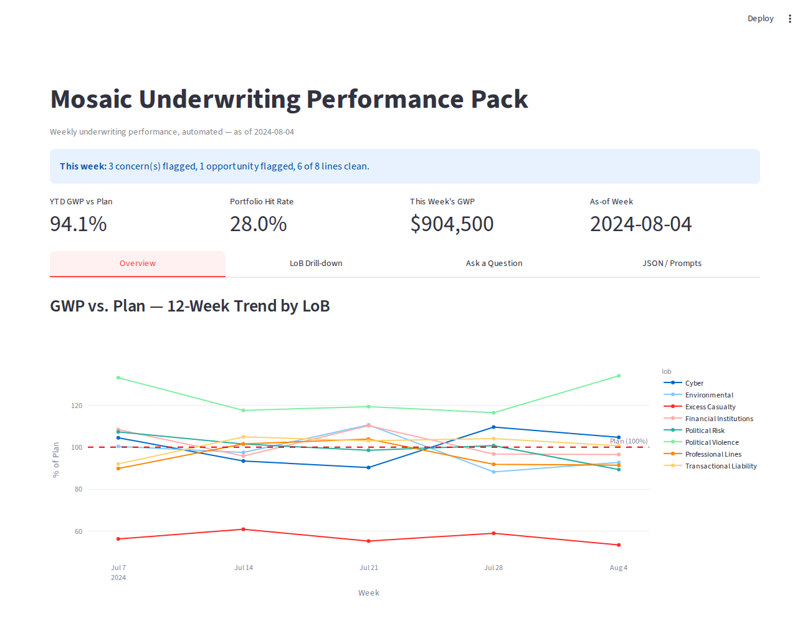
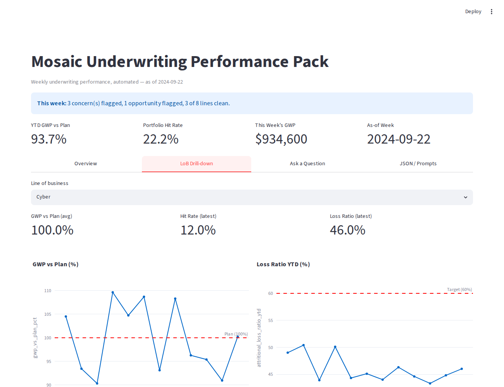

# Mosaic Underwriting Performance Pack

Every Monday, an analyst used to spend half a day pulling four spreadsheets together into a static Excel workbook and a two-page Word narrative. This replaces that process: it ingests the same four weekly extracts, finds what's statistically unusual, separates that from what's financially material, writes an executive-ready narrative, and serves all of it through an interactive dashboard — unattended at 6am, or live in front of someone.

Every screenshot below is taken directly from the running application against the real assessment dataset. Nothing here is mocked.

---

## What it does

**Finds what matters, without a black box.** Five independent checks — GWP vs. plan, hit-rate collapse, loss-ratio trend, claims shock, and pipeline friction — each answer a different business question. There's no hand-picked weighting scheme combining them into one score; every finding is ranked on a common, peer-normalised scale instead.

**Keeps three different questions separate.** A finding can be statistically extreme but financially small, or financially significant but statistically ordinary, or lower-ranked but the only thing currently getting worse. So *severity* (how unusual), *materiality* (how costly), and *trajectory* (which direction it's heading) are always shown side by side — never blended into a single number that would hide one of them.

| Concern | Near miss |
|---|---|
|  |  |

The near-miss case above is the clearest example of why this matters: Environmental doesn't rank in the top three by severity, but the dashboard still surfaces it explicitly, because it's the only finding in the entire portfolio currently getting worse while everything ranked above it is stable or improving.

**Writes the narrative an executive actually wants to read.** The model never sees raw data tables — only the structured findings above. Every number is cited, recent and ongoing concerns are distinguished, and recommended actions are framed as questions to investigate, not confident diagnoses the data doesn't support. The output is checked after generation against five common failure modes (incorrect near-miss framing, missing severity context, stray headers, ambiguous resolution language, excessive length) before being accepted — and rewritten automatically if any of them fire.

**Lets you go back in time.** Every check re-runs against any prior week on demand, so you can see exactly how the findings have rotated over the last 12 weeks — not just a static snapshot of today.

**Drills into any line of business**, with the same reference lines the detection logic itself checks against drawn directly onto the chart — so what you see is exactly what triggered the finding above it.

---

## Built to be trusted, not just demoed

- **Deterministic detection, AI for communication only.** The model never decides what counts as a finding — it only turns findings that already exist into language.
- **107 passing tests**, several of which exist specifically because an end-to-end run caught a real bug a narrower test wouldn't have.
- **Versioned prompts.** Every prompt is a plain-text file with a version number and changelog, tracked in git like code — not a black box of trial and error.
- **Designed to fail safely.** Missing or malformed input is caught before analysis runs; if the model is unavailable, a complete offline narrative still ships rather than nothing at all.

---

## Stack

Python + pandas for deterministic analytics, Streamlit for the interactive dashboard, Plotly for charts, and the Anthropic API for narrative generation.

For the full engineering write-up — architecture, the methodology behind the detection layer, file-by-file guidance, and the complete test breakdown — see [`ENGINEERING.md`](ENGINEERING.md).

---
